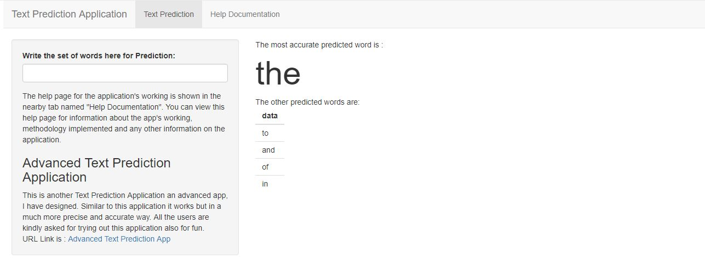

Shiny Text Prediction Application
========================================================
author: Gomathy Sankar K
date: 22 - 07 - 2020
autosize: true

About the Application
========================================================

This appplication is completely deidcated for predicting the next word based on the word (or) set 
of words that is given as the input by the user.  
An example of this application's performing is if the user writes an input 'he is a friend of' then 
some of the next words that are predicted and displayed are 'mine', 'him', 'hers' and so on.  
So, this example is depicted in order to understand the basics of this application's operation.  
Also, in the main panel of the application page, a wordcloud is plotted depicting the top appropriate 
predcited words. 

N-Gram Modelling:
========================================================

A training dataset sampled from the lines read from the 3 different text files is tokenized and 1, 2 and 3 gram modelling is performed. In this application, the highest n-gram model considered is the trigram model. 

**Unigram - Modelling** :  The text dataset is split into single words and frequency of occurence of 
each word is noted.  
**Bigram - Modelling** :  The text dataset is split into a combination of 2 words and the frequency of 
each word set is calculated.  
**Trigram - Modelling** :  The text dataset is split into a combination of 3 words and the frequency of 
each word set is calculated.  

Prediction Method
========================================================

The Text Prediction algorithm in this application works based on the principle of stupid back-off algorithm. The main concept of this algorithm is, the application checks for the word to be predicted in a higher n-gram model. Based on the user's required number of top predicted words, it starts to predict. If the number of predicted words from the higher n-gram model equals to that of the required number it displays the predicted words. 
If it is not equal, then it continues it's search in the next lower n-gram model and continues to predict until, it finds the required number of predicted words. Then after predicting the required number of appropriate words, it displays the predicted words in a table format.

Text Prediction Application Overview
========================================================

In this slide, the HTML page of the application in it's default mode is shown.  

